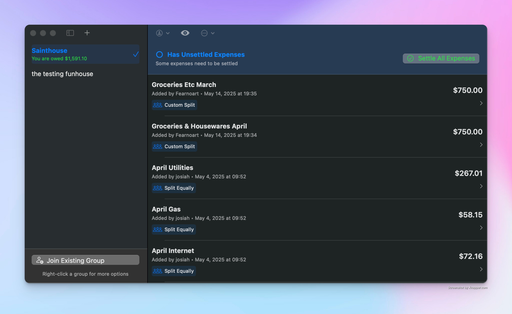

# Halfhazard

Halfhazard is a small app for  iOS and macOS that tracks shared expenses. I wrote it for me and my partner to use. Its distributed only via testflight to our devices. This app will forever be rough around the edges, and will never see an official release for the app store.

I wrote several versions of this, and eventually used it as a project experiment with Claude Code, which i've found very useful. Please don't judge Claude's code too harshly, it did its best, if there were any failures they were mine.
## Basic features
The app structures expenses inside of groups, which can be shared between users. Groups will inform the user how much they owe / are owed in aggregate, for all non-settled expenses within that group. 

Firebase is used for cloud storage and authentication. 

## Screenshots

